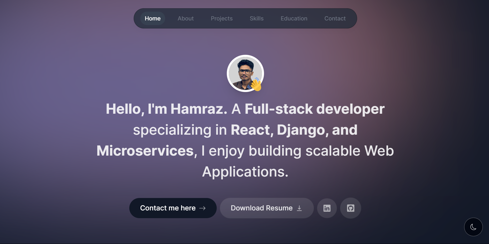

# Hamraz Hakeem - Portfolio Website



A modern, responsive portfolio website built with Next.js 15 and React, showcasing my skills, projects, and professional journey.

## 🚀 Features

- **Modern Architecture**: Built with Next.js 15 App Router for optimal performance
- **Server Components**: Leverages React Server Components for faster page loads
- **Responsive Design**: Optimized for all devices from mobile to desktop
- **Dark/Light Mode**: Toggle between themes with persistent user preference
- **Interactive UI**: Smooth animations and transitions using Framer Motion
- **Dynamic Sections**:
  - About Me
  - Skills & Technologies
  - Project Showcase
  - Education Timeline
  - Contact Form
- **Server Actions**: Built-in form handling with Next.js Server Actions
- **SEO Optimized**: Meta tags and optimized content structure

## 💻 Technologies

- **Framework**: Next.js 15
  - App Router
  - Server Components
  - Server Actions
- **Frontend**: React, TypeScript
- **Styling**: Tailwind CSS
- **Animations**: Framer Motion
- **Email**: React Email, Resend API
- **Deployment**: Vercel

## 📦 Installation

1. Clone the repository:
   ```bash
   git clone https://github.com/hamrazhakeem/portfolio.git
   cd portfolio
   ```

2. Install dependencies:
   ```bash
   npm install
   ```

3. Create a `.env.local` file in the root directory with your Resend API key:
   ```
   RESEND_API_KEY=your_resend_api_key
   ```

4. Run the development server:
   ```bash
   npm run dev
   ```

5. Open [http://localhost:3000](http://localhost:3000) to view the site

## 🛠️ Customization

- Update personal information in `lib/data.ts`
- Replace images in the `public` folder
- Modify theme colors in `tailwind.config.js`
- Customize email templates in `email/contact-form-email.tsx`

## 📱 Project Structure

```
├── actions/           # Server actions for form handling
├── app/               # Next.js app router pages
├── components/        # React components
├── context/           # React context providers
├── email/             # Email templates
├── lib/               # Utility functions and data
└── public/            # Static assets
```

## 🚢 Deployment

This portfolio is deployed on Vercel. To deploy your own version:

1. Push your repository to GitHub
2. Import the project to Vercel
3. Add your environment variables
4. Deploy!
